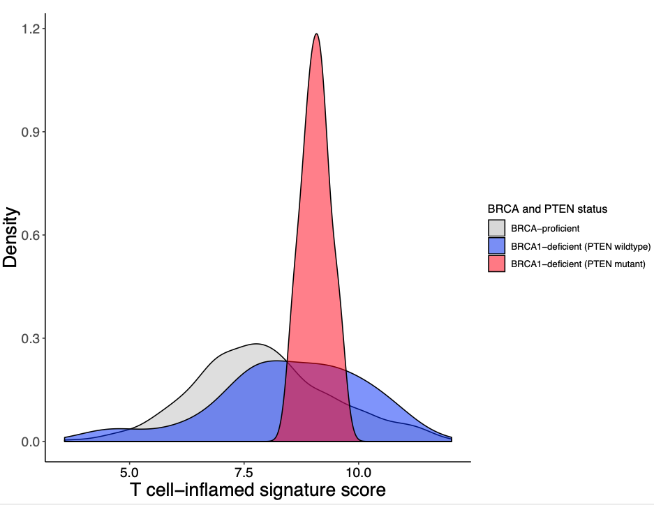

Breast cancer is the most common cancer among women worldwide with an estimated 2 million new cases diagnosed each year (Global Cancer Observatory). Inherited genetic defects in BRCA1 and BRCA2 genes increases lifetime risk of breast cancer. Both BRCA1 and BRCA2 carries have ~70% lifetime risk of developing breast cancer. Here, we investigated the potential utility of these genes as biomarkers for immune signatures, and by extension immunotherapy, in breast cancer patients. To this end, we analysed 1,489 publicly available breast cancers from The Cancer Genome Atlas (TCGA) and Wellcome Trust Institute (WSI). We found that while both BRCA1 and BRCA2 are associated with genomic instability, only BRCA1 but not BRCA2 is associated with immune markers in breast cancer patients. The relationship between BRCA1 and immune signatures in these patients may be, in part, be attributed PTEN mutations. Full report on this study has been published here: https://journals.plos.org/plosone/article?id=10.1371/journal.pone.0215381

